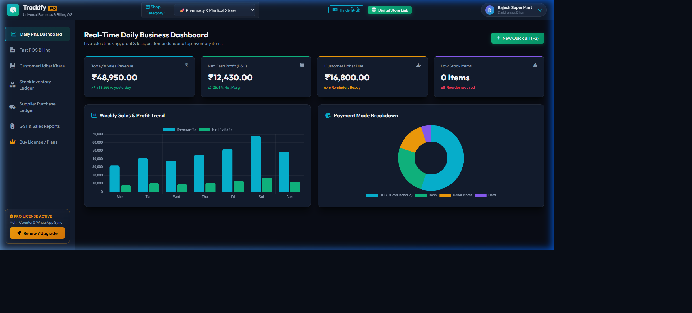
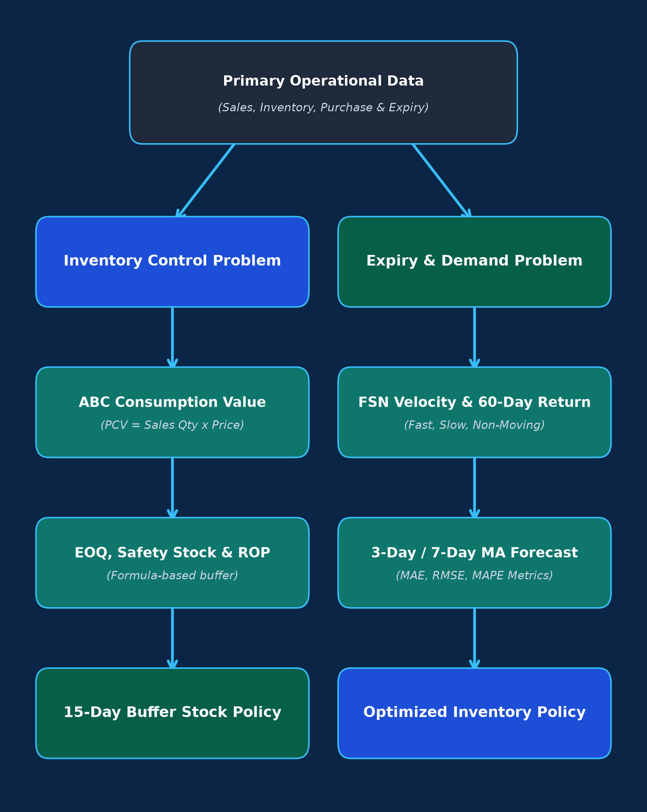
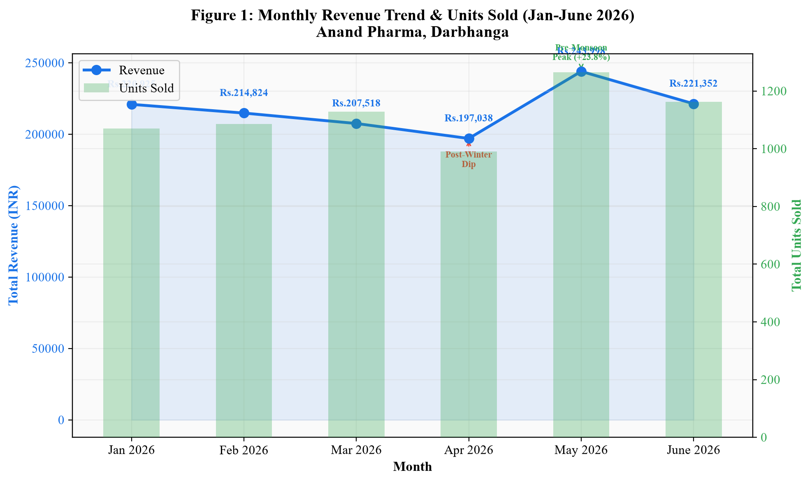
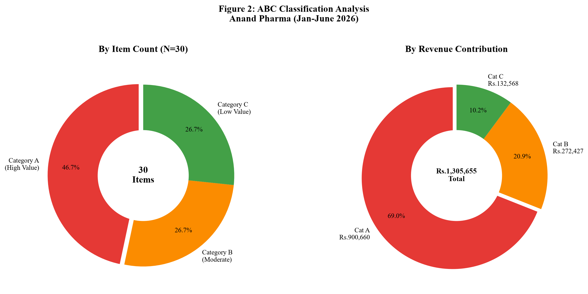
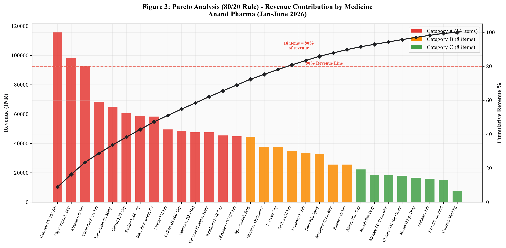
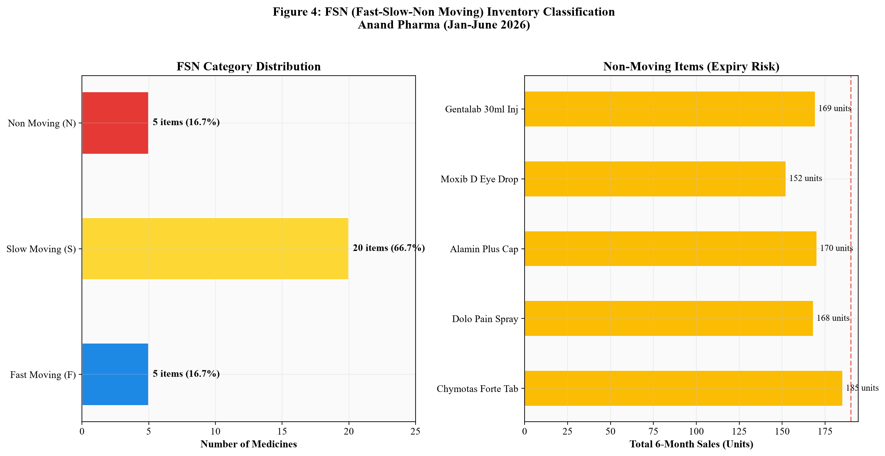
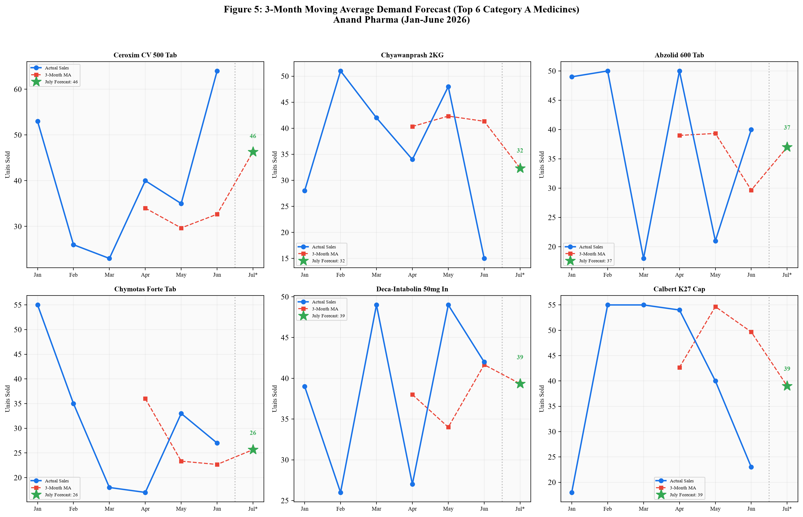
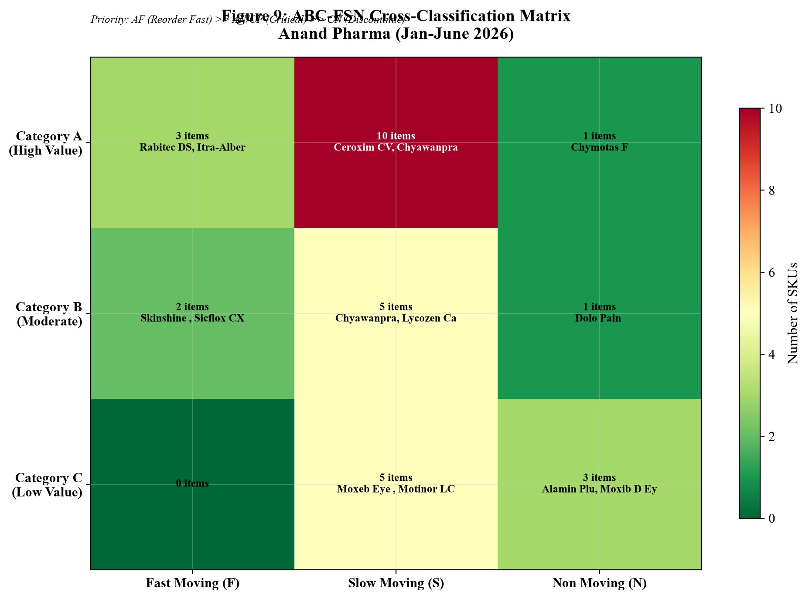
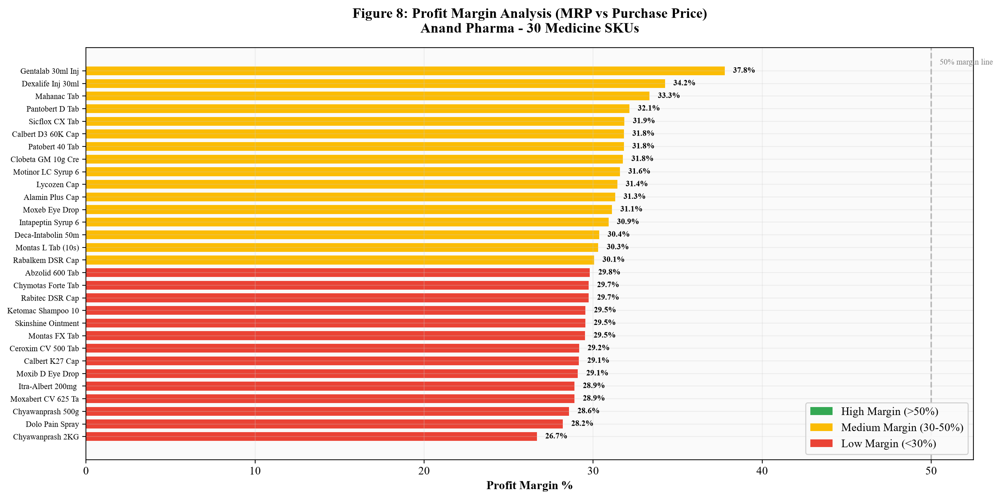

# 🎓 IIT Madras BDM Capstone Project & Trackify Pro OS

  

  
  
  

---

## 📌 Project Summary

This repository contains the complete academic research deliverables, inventory optimization models, empirical data analytics, and commercial-grade SaaS web software for the **Business Data Management (BDM) Capstone Project** under the **IIT Madras Online BS Degree Program**.

* **Student Name**: Shudhanshu Kumar Yadav
* **Roll Number**: `23F1000204`
* **Project Topic**: *Sales Trend & Inventory Optimization Analysis of Anand Pharma, Darbhanga*
* **Final Academic Evaluation**: **Approved & Completed with Grade B (70 Marks / 100)**

---

## 🚀 Trackify Pro — Universal Business Operating System

Developed alongside the academic research, **Trackify Pro** is a modern, high-performance web-based POS & inventory tracker designed to help retail shops, pharmacies, kirana stores, and apparel outlets digitize operations.

### 🌟 Key Web App Features:
* 📊 **Real-Time Daily P&L Dashboard**: Live tracking of revenue, net profit margin (25.4%), customer dues, and low-stock alerts.
* 🛒 **Fast POS Billing Counter**: Barcode search, item level discounts, auto-calculated 12% GST invoice generation.
* 📕 **Customer Udhar Khata Ledger**: Track credit dues, generate automated WhatsApp payment reminders with instant UPI links.
* 💊 **7 Multi-Industry Profiles**: 1-click profile switching between Kirana, Garments, Electronics, Hardware, Pharmacy, Restaurant, and Repair Services.
* 📸 **Camera Barcode Scanner & Counter UPI QR**: Built-in camera scanning modal and counter payment QR modal.

  <b>Live Web App Location:</b> <code><a href="./app/index.html">app/index.html</a></code>

---

## 📊 Empirical Data Analytics & Proof of Research

The academic project analyzes 6 months of primary transaction data from **Anand Pharma, Darbhanga, Bihar** to solve overstocking and stockout issues using quantitative inventory frameworks.

### 1. Methodology Flowchart

  

### 2. Monthly Sales & Revenue Trend

  

### 3. ABC Revenue Classification (Donut Chart) & Pareto Analysis (80/20 Rule)

  
  

### 4. FSN Velocity Analysis & Demand Forecasting

  
  

### 5. Multi-Criteria ABC-FSN Matrix & Profit Margins

  
  

---

## 📂 Complete Academic Deliverables & Milestone Files

| Milestone / Deliverable | File Link | Description |
| :--- | :--- | :--- |
| 📄 **Final Term Report** | [`23F1000204_Final_Term.pdf`](./23F1000204_Final_Term.pdf) | Official Final Term Capstone Report (Grade B / 70 Marks). |
| 📊 **Viva Presentation** | [`23F1000204_VIVA.pdf`](./23F1000204_VIVA.pdf) | Official Viva Voce Presentation Slide Deck. |
| 📝 **Project Proposal** | [`Proposal.pdf`](./Proposal.pdf) | Initial Problem Identification & Proposal. |
| 📑 **Mid-Term Report** | [`Mid_Term.pdf`](./Mid_Term.pdf) | Ingestion & Mid-Term Analysis Report. |
| 📈 **Editable PPTX** | [`BDM PPT - Copy.pptx`](./BDM%20PPT%20-%20Copy.pptx) | Editable PowerPoint Presentation. |
| 📊 **Primary Dataset** | [`Anand_Pharma_BDM_Complete_Dataset.xlsx`](./Anand_Pharma_BDM_Complete_Dataset.xlsx) | Primary dataset (6-month transactions & ABC-FSN models). |
| ✅ **IITM Checklist** | [`Checklist for BDM Project.pdf`](./Checklist%20for%20BDM%20Project.pdf) | Official IIT Madras Capstone submission checklist. |
| 💻 **Trackify Pro App** | [`app/`](./app/) | Complete web application (`index.html`, `universal-styles.css`, `universal-app.js`). |

---

## 🛠️ How to Run Locally

1. Clone or download this repository.
2. Navigate to the `app/` directory.
3. Double click [`app/index.html`](./app/index.html) to run the **Trackify Pro** application in any modern web browser.

---

## 📜 License
Developed for **IIT Madras BDM Capstone Project** by Shudhanshu Kumar Yadav (`23F1000204`). Distributed under MIT License.
