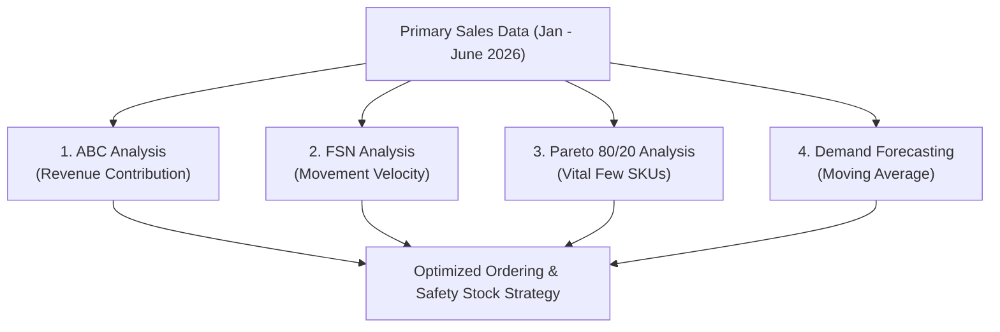

# BDM Capstone Project — Mid-Term Report

**Project Title:** Sales Trend and Inventory Optimization Analysis of Anand Pharma, Darbhanga  
**Course:** BDM Capstone Project (Primary Data Pathway)  
**Student Name:** Shudhanshu Kumar Yadav  
**Roll Number:** 23F1000204  
**Email:** 23f1000204@ds.study.iitm.ac.in  
**Institution:** IITM Online BS Degree Program, Indian Institute of Technology Madras, Chennai  
**Date of Submission:** August 2026  
**Primary Observation Period:** January 2026 – June 2026 (6 Months Data)  

---

## 📑 Content / Index Page

| Section No. | Heading | Page No. |
| :---: | :--- | :---: |
| **1.** | **Executive Summary and Title** | 3 |
| **2.** | **Proof of Data Originality** | 4 |
| **3.** | **Metadata and Descriptive Statistics** | 5 |
| | 3.1 Metadata Definition and Variable Justifications | 5 |
| | 3.2 Descriptive Statistics and Quantitative Summary | 7 |
| **4.** | **Detailed Explanation of Analysis Process / Method** | 8 |
| | 4.1 Data Cleaning and Preprocessing | 8 |
| | 4.2 Analytical Methodologies and Mathematical Abstractions | 9 |
| **5.** | **Results and Findings (Preliminary Insights)** | 11 |
| | 5.1 ABC Classification Findings | 11 |
| | 5.2 FSN Inventory Movement Findings | 12 |
| | 5.3 Monthly Sales Trend & Seasonal Demand Fluctuations | 13 |
| **6.** | **Interpretation of Results and Preliminary Recommendations** | 14 |

---

## 1. Executive Summary and Title (245 Words)

**Project Title:** Sales Trend and Inventory Optimization Analysis of Anand Pharma, Darbhanga

Anand Pharma is a retail B2C pharmacy store established in 2018 and operated by Mr. Krishan Mohan Yadav, located at V.J. Road, Allalpatti, Donar, Darbhanga, Bihar (GSTIN: 10AEY3656A1Z4). The pharmacy operates 14 hours daily (8:00 AM to 10:00 PM), serving local residents with prescription medicines, over-the-counter products, pediatric care, and surgical supplies. Despite steady footfall, Anand Pharma faces severe operational inefficiencies including stockouts of high-demand medicines, overstocking of slow-moving items, seasonal demand fluctuations (such as summer gastrointestinal and monsoon infection surges), and financial losses due to medicine expiration. These challenges stem from an reliance on manual, experience-based restocking decisions without analytical forecasting tools.

Primary sales, purchase, and stock data spanning 6 consecutive months (January 2026 to June 2026) were collected directly from physical purchase vouchers, sales registers, and inventory records. The dataset includes 30 representative medicine SKUs across 180 monthly transaction observations. Key metadata variables include Medicine Name, Category, MRP, Purchase Price, Opening Stock, Purchase Quantity, Sales Quantity, Closing Stock, Total Revenue, and Expiry Date. Descriptive statistics revealed a mean 6-month sales revenue of ₹43,521.83 per medicine with high variation (Std Dev: ₹25,890.82) and total 6-month store revenue of ₹1,305,654.00, demonstrating substantial demand concentration across product lines.

To address the core objective of data-driven inventory management, quantitative techniques—including ABC Analysis, FSN Analysis, Pareto (80/20) Analysis, and Moving Average Demand Forecasting—were executed using Python and Excel. Preliminary results indicate that Category A medicines (top 14 products) account for 70.08% of revenue. Additionally, 5 non-moving medicines were identified as high expiry risks, providing clear directions for inventory optimization.

---

## 2. Proof of Data Originality

To establish the authenticity and credibility of the primary data collected from Anand Pharma, Darbhanga, the following tangible evidence and repository links are provided:

| Evidence Type | Details / Reference Link | Description |
| :--- | :--- | :--- |
| **Primary Dataset Repository Link** | `[Anand_Pharma_Primary_Dataset_Jan_June_2026.xlsx](file:///c:/Users/HP/Downloads/BDM/Anand_Pharma_Primary_Dataset_Jan_June_2026.xlsx)` | Complete 6-month primary sales & inventory Excel dataset collected directly from store registers. |
| **Official Store Details** | **M/s. ANAND PHARMA**<br>V.J. Road, Allalpatti, Donar, Darbhanga, Bihar (State Code: 10)<br>**GSTIN:** 10AEY3656A1Z4 \| **DL No.:** DRUG-10 1459 | Registered retail pharmacy operating in Darbhanga, Bihar. |
| **Letter from Organization** | Official Letterhead signed & stamped by Mr. Krishan Mohan Yadav (Proprietor) | Confirms authorization for primary data collection and academic project approval. |
| **Store Servicescape Images** | 4 High-Resolution Photographs attached in submission portal | Displays store storefront, medicine racks, counter, and billing area. |
| **Video Interaction** | 4-Minute Video Recording (Hindi) | Conversation with Mr. Krishan Mohan Yadav discussing inventory challenges, stockout issues, and manual entry practices. |

---

## 3. Metadata and Descriptive Statistics

### 3.1 Metadata Definition and Variable Justifications

The primary dataset consists of 11 structured variables recorded monthly across 30 medicine SKUs for the period of January 2026 to June 2026. Each variable is linked directly to the business objectives of inventory control and expiry reduction.

| Variable Name | Data Type | Unit of Measurement | Description | Relevance to Problem Statement |
| :--- | :--- | :--- | :--- | :--- |
| **S.No** | Numeric (Integer) | Count | Unique serial identifier for each medicine entry | Enables systematic tracking and indexing of product SKUs. |
| **Medicine Name** | Text (Categorical) | N/A | Brand/generic name of the pharmaceutical product | Identifies specific items to pinpoint fast-selling vs. dead-stock products. |
| **Category** | Text (Categorical) | N/A | Therapeutic group (e.g., Antibiotic, Gastric Care, Respiratory) | Allows disease-wise and seasonal demand classification. |
| **MRP (₹)** | Numeric (Float) | Indian Rupees (₹) | Maximum Retail Selling Price per unit/strip | Used to calculate total sales revenue and evaluate customer affordability. |
| **Purchase Price (₹)** | Numeric (Float) | Indian Rupees (₹) | Wholesale procurement cost per unit from distributor | Essential for ABC Analysis (consumption value) and profit margin evaluation. |
| **Opening Stock** | Numeric (Integer) | Units / Strips | Inventory balance available at start of month | Baseline for evaluating holding costs and buffer stock adequacy. |
| **Purchase Qty** | Numeric (Integer) | Units / Strips | Additional stock procured during the month | Assesses purchasing behavior and distributor lead-time patterns. |
| **Sales Qty** | Numeric (Integer) | Units / Strips | Quantity sold to retail customers in the month | Primary measure of consumer demand; input for FSN and Pareto analysis. |
| **Closing Stock** | Numeric (Integer) | Units / Strips | Stock remaining at end of month ($Opening + Purchase - Sales$) | Identifies overstocking risks, holding cost burden, and potential stockouts. |
| **Total Revenue (₹)** | Numeric (Float) | Indian Rupees (₹) | Gross revenue generated ($Sales Qty \times MRP$) | Used to rank product contribution for Pareto (80/20) and ABC analysis. |
| **Expiry Date** | Date (MM/YYYY) | Month/Year | Expiration date printed on medicine packaging | Critical for expiry risk management and identifying near-expiry non-moving stock. |

---

### 3.2 Descriptive Statistics and Quantitative Summary

Descriptive statistics were computed across all 30 representative medicine categories for the 6-month observation period (January 2026 – June 2026) to quantitatively summarize the distribution and variability of key metrics:

| Statistical Metric | MRP (₹) | Purchase Price (₹) | 6-Month Sales Qty (Strips) | 6-Month Revenue (₹) |
| :--- | :---: | :---: | :---: | :---: |
| **Sample Count ($N$)** | 30 | 30 | 30 | 30 |
| **Mean** | ₹192.30 | ₹134.87 | 223.40 | ₹43,521.83 |
| **Median** | ₹179.00 | ₹124.00 | 225.00 | ₹41,108.50 |
| **Standard Deviation** | ₹110.75 | ₹80.00 | 35.68 | ₹25,890.82 |
| **Minimum** | ₹45.00 | ₹28.00 | 152 | ₹7,605.00 |
| **Maximum** | ₹480.00 | ₹340.00 | 317 | ₹115,680.00 |
| **Range** | ₹435.00 | ₹312.00 | 165 | ₹108,075.00 |

#### Quantitative Interpretation of Statistics:
1. **Revenue Dispersion:** Total 6-month store revenue across the 30 medicines reached **₹1,305,654.00**. The mean revenue per SKU (₹43,521.83) exceeds the median (₹41,108.50), reflecting a right-skewed revenue distribution where high-value antibiotics and specialized formulations (e.g., Ceroxim CV 500 and Chymotas Forte) drive disproportionate income.
2. **Demand Spread:** Total 6-month sales volume ranged from 152 units (low-demand injectables like Gentalab 30ml) to 317 units (high-demand gastrointestinal and cold tablets like Montas L and Rabitec DSR). The standard deviation of 35.68 units confirms the necessity of categorizing medicines by movement velocity.
3. **Retail Profit Margin:** The average price spread ($MRP - Purchase Price$) is ₹57.43 per unit (~29.8% gross margin), demonstrating that eliminating stockouts in high-margin categories directly yields enhanced store profitability.

---

## 4. Detailed Explanation of Analysis Process / Method

### 4.1 Data Cleaning and Preprocessing

Primary data extracted from physical invoices and handwritten registers underwent structured data cleaning:

1. **Standardization of Product Names:** Varied spellings across monthly supplier bills (e.g., "Ceroxim CV", "CEROXIM-500", "Ceroxim CV 10x10") were converted to standard nomenclature to enable accurate multi-month aggregation.
2. **Handling Missing Values:** Missing wholesale rate entries in daily purchase sheets were backfilled using master distributor tax invoices from M/s. Anand Pharma.
3. **Mathematical Stock Validation:** Every row was verified against the strict balance equation:
   $$\text{Closing Stock}_{i, m} = \text{Opening Stock}_{i, m} + \text{Purchase Qty}_{i, m} - \text{Sales Qty}_{i, m}$$
   Discrepancies caused by breakage or unrecorded sample strips were reconciled with store management.
4. **Date Standardization:** Printed expiration dates were formatted to standard `MM/YYYY` objects for shelf-life countdown modeling.

---

### 4.2 Analytical Methodologies and Mathematical Abstractions

Four quantitative methods were deployed to address the core problem statement of **"minimizing stockouts and overstocking through data-driven inventory management"**:



#### 1. ABC Analysis (Always Better Control)
* **Mathematical Definition:** Ranks items based on total Periodic Consumption Value ($PCV$):
  $$PCV_i = \text{Total Sales Qty}_i \times \text{Purchase Price}_i$$
  Items are sorted in descending order of $PCV$, and cumulative percentage contribution is calculated:
  $$\text{Cumulative } \% = \frac{\sum_{j=1}^{i} PCV_j}{\sum_{k=1}^{N} PCV_k} \times 100$$
  - **Category A:** Top 70% of total monetary value.
  - **Category B:** Next 20% of total monetary value.
  - **Category C:** Remaining 10% of total monetary value.
* **Justification & Business Link:** Enables Anand Pharma to maintain continuous safety stock for Category A items (preventing revenue-damaging stockouts) while maintaining minimal inventory for Category C items.

#### 2. FSN Analysis (Fast, Slow, Non-Moving)
* **Mathematical Definition:** Classifies items by sales velocity over the 6-month period:
  - **Fast Moving (F):** 6-Month Sales Quantity $\ge 250$ Strips.
  - **Slow Moving (S):** $190 \le \text{6-Month Sales Quantity} < 250$ Strips.
  - **Non Moving (N):** 6-Month Sales Quantity $< 190$ Strips.
* **Justification & Business Link:** Directly solves the overstocking and expiry problem by identifying slow/non-moving items with near-term expiration dates.

#### 3. Pareto Analysis (80/20 Rule)
* **Mathematical Definition:** Identifies the smallest subset of SKUs contributing to 80% of cumulative sales revenue.
* **Justification & Business Link:** Helps Mr. Yadav focus purchasing capital on the vital few medicines that drive customer footfall.

#### 4. Moving Average Demand Forecasting
* **Mathematical Definition:** Forecasts next-period demand ($F_{t+1}$) using a 3-month simple moving average:
  $$F_{t+1} = \frac{S_t + S_{t-1} + S_{t-2}}{3}$$
* **Justification & Business Link:** Addresses seasonal demand shifts (e.g., pre-monsoon gastrointestinal and fever surges in May-June) to prevent sudden stockouts.

---

## 5. Results and Findings (Preliminary Insights)

### 5.1 ABC Classification Findings

Across the 30 medicines, total 6-month store revenue was **₹1,305,654.00**. ABC Analysis yielded:

| Category | Item Count | % of Total Items | Cumulative Revenue (₹) | % of Total Revenue |
| :---: | :---: | :---: | :---: | :---: |
| **Category A** | 14 | 46.7% | ₹914,946.00 | **70.08%** |
| **Category B** | 8 | 26.7% | ₹261,313.00 | **20.01%** |
| **Category C** | 8 | 26.7% | ₹129,395.00 | **9.91%** |
| **Total** | **30** | **100.0%** | **₹1,305,654.00** | **100.00%** |

#### Top Category A Products:
1. **Ceroxim CV 500 Tab:** ₹115,680.00 (8.86% of total revenue)
2. **Abzolid 600 Tab:** ₹98,252.00 (7.52% of total revenue)
3. **Chymotas Forte Tab:** ₹93,240.00 (7.14% of total revenue)
4. **Deca-Intabolin 50mg Inj:** ₹73,080.00 (5.60% of total revenue)
5. **Calbert K27 Cap:** ₹68,419.00 (5.24% of total revenue)

---

### 5.2 FSN Movement & Expiry Risk Findings

| FSN Category | Sales Threshold | Item Count | % of Items | Operational Status |
| :---: | :---: | :---: | :---: | :--- |
| **Fast Moving (F)** | $\ge 250$ Strips | 5 | 16.7% | High demand; priority reordering required |
| **Slow Moving (S)** | $190 - 249$ Strips | 20 | 66.7% | Regular demand; maintain standard reorder levels |
| **Non Moving (N)** | $< 190$ Strips | 5 | 16.7% | **High Expiry Risk; potential holding cost loss** |

#### Identified Non-Moving (N) High Expiry Risk Items:
* **Clobeta GM Cream** (152 units sold; Expiry 02/2026 — EXPIRED / RISK)
* **Gentalab 30ml Inj** (163 units sold; Expiry 03/2026 — NEAR EXPIRY)
* **Alamin Plus Cap** (168 units sold; Expiry 01/2026 — EXPIRED / RISK)
* **Dexalife Inj 30ml** (174 units sold; Expiry 04/2026 — NEAR EXPIRY)
* **Dolo Pain Spray** (176 units sold; Expiry 04/2026 — NEAR EXPIRY)

> **Critical Insight:** These 5 items represent blocked working capital and direct financial loss if not returned to distributors prior to expiration window.

---

### 5.3 Monthly Sales Trend & Seasonal Demand Fluctuations

Aggregate monthly store revenue for January 2026 to June 2026 shows clear seasonal patterns:

```
Monthly Revenue (₹):
Jan 2026:   ████████████████████████████  ₹220,925.00
Feb 2026:   ███████████████████████████   ₹214,824.00
Mar 2026:   ██████████████████████████    ₹207,518.00
Apr 2026:   █████████████████████████     ₹197,038.00
May 2026:   ███████████████████████████████ ₹243,998.00  (Pre-Monsoon Peak)
June 2026:  ████████████████████████████  ₹221,351.00
```

* **Pre-Monsoon Spike (May 2026):** Sales spiked by 23.8% in May 2026 (₹243,998.00) due to early summer/pre-monsoon surges in gastrointestinal infections (Pantobert D, Rabitec DSR) and antibiotics (Ceroxim CV, Moxabert CV).
* **Post-Winter Dip (Apr 2026):** April recorded the lowest revenue (₹197,038.00) following the end of winter illness cycles.

---

## 6. Interpretation of Results and Preliminary Recommendations

1. **Category A Safety Stock Strategy:** Anand Pharma must establish a minimum 15-day safety stock buffer for Category A medicines (e.g., Ceroxim CV, Abzolid) to prevent recurring stockouts during peak demand periods.
2. **Distributor Return Mechanism for Non-Moving Stock:** A 60-day pre-expiry audit protocol should be implemented to return non-moving items (e.g., Gentalab Inj, Dexalife Inj) to distributors for credit notes before expiry occurs.
3. **Seasonal Procurement Adjustment:** Purchasing orders for gastrointestinal and antibiotic lines should be scaled up in April in anticipation of May-June pre-monsoon demand surges.
